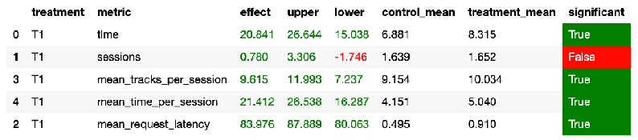

### 1. Abstract

Т.к. лучшим из рекоммендеров из рассмотренных на семинарах был Contextual, возьмём его за основу и доработаем.

В первую очередь будем брать рандомный трек из уже рекомендованных **похожему** пользователю на текущего.
Похожего пользователя будем определять так: берём рандомный трек из оценённых (track_time >= 0.6) треков текущего пользователя, смотрим, кому ещё понравился этот трек - берём рандомного пользователя из списка, и выбираем рандомный трек из рекомендованных ему (будем полагаться на то, что можем судить о совпадении музыкальных вкусов пользователей, смотря только на 1 трек, хотя очевидно, можно масштабировать и на множество треков)

### 2. Детали
В [server.py](./botify/botify/server.py#L37) добавлен в redis маппинг tracks_to_users из рекомендаций, реализация метода upload_tracks_to_users [здесь](./botify/botify/track.py#L109) + соответствующие записи в [config.json](./botify/botify/config.json#L17)

[Реализация самого рекомендера](./botify/botify/recommenders/myRecommender.py)

### 3. Результаты A/B эксперимента

Эксперимент Contextual vs MyRecommender в [файле](./jupyter/Week1Seminar.ipynb)

В сравнении с Contextual рекомендером прирост 22% - задача выполнена

Также в [файле](./jupyter/MyRecommenderVsOthers.ipynb) эксперимент со всеми остальными рекоммендерами, как на семинарах
